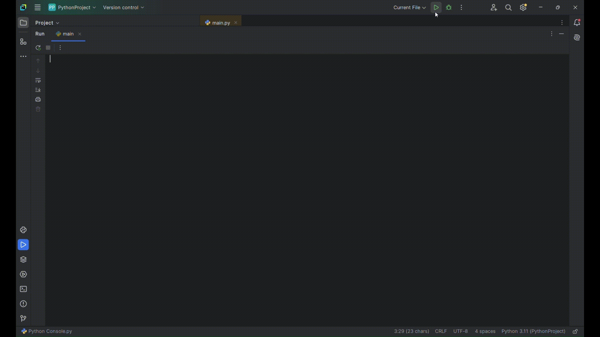

А. Д. Пашков

Научный руководитель – Т. Ю. Круковская, кандидат педагогических наук, доцент кафедры высшей математики, ОмГУПС.

Омский государственный университет путей сообщения (ОмГУПС), г. Омск, Российская Федерация

РЕШЕНИЕ ЗАДАЧИ ОДНОФАКТОРНОЙ ЛИНЕЙНОЙ РЕГРЕССИИ    
С ПОМОЩЬЮ НЕЙРОННОЙ СЕТИ

Аннотация. В статье рассматривается пример решения задачи регрессии с помощью полносвязной нейронной сети. Наряду с существующими способами построения спецификации модели регрессии в современных условиях развития генеративных технологий наблюдается широкое распространение вычислительных алгоритмов нейросетевых моделей для анализа данных и прогнозирования конечного результата.  Подчеркнута значимость анализа и построения спецификаций моделей регрессии в эконометрических исследованиях с целью изучения возможных направлений развития секторов экономики. Показаны элементы отдельных этапов формирования полносвязной нейронной модели на языке программирования Python. Представлен фрагмент процесса обучения нейронной сети с выбранными метриками, характерными для решения данной задачи.  

Ключевые слова. Однофакторная линейная модель регрессии, полносвязная модель нейронной сети, обучение нейронной сети, спецификация модели регрессии.

A. D. Pashkov

Omsk State University of Railway Transport (OmGUPS), Omsk, Russian Federation

SOLVING THE PROBLEM OF ONE-FACTOR LINEAR REGRESSION
USING A NEURAL NETWORK

Annotation. The article considers an example of solving a regression problem using a fully connected neural network. Along with the existing methods of constructing a regression model specification, in modern conditions of the development of generative technologies, computational algorithms of neural network models for data analysis and prediction of the final result are widely used.  The importance of analyzing and constructing specifications of regression models in econometric research in order to study possible directions for the development of economic sectors is emphasized. The elements of the individual stages of forming a fully connected neural model in the Python programming language are shown. A fragment of the neural network learning process with selected metrics specific to solving this problem is presented.

Keywords.  One-factor linear regression model, fully connected neural network model, neural network training, regression model specification.

[]
